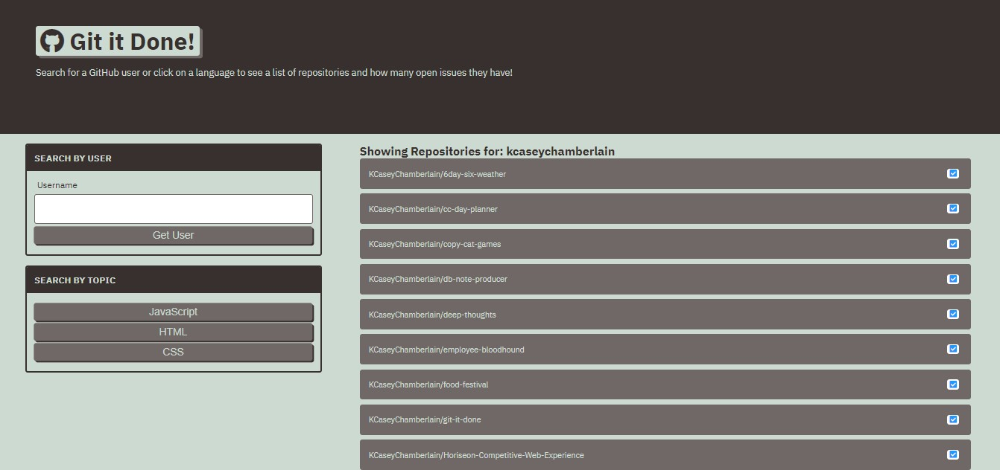

# Git It Done

### Description
This front-end web application utilizes GitHub's third party API to allow the user to search GitHub's API by user or by topic (HTML, JavaScript CSS).
### License

This application is licensed under MIT

### Application Demo

### Table of Contents
- [Description](#description)
- [Contributing](#contributing)
- [Tests](#tests)
- [Questions?](#questions)

### Contributing
No contributions at this time.

### Tests
N/A

### Questions
GitHub Username: (kcaseychamberlain) 

View the project in GitHub at: https://github.com/KCaseyChamberlain/git-it-done

View the application live hosted at: https://kcaseychamberlain.github.io/git-it-done/

If you have any questions, contact Casey at: caseygchamberlain@gmail.com